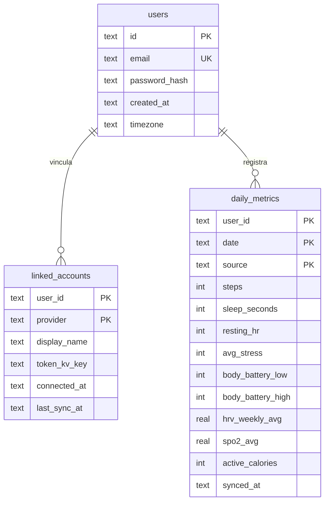
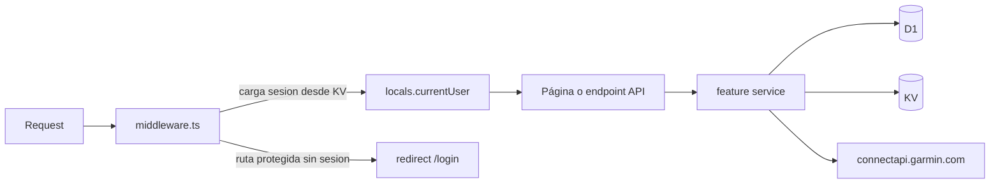

# Arquitectura

**Track Forge** es un centro de datos y análisis implementado como aplicación Astro SSR que corre íntegramente en un Cloudflare Worker. El frontend (islas React) y el backend (endpoints de API) viven en el mismo Worker; no hay servidor separado.

El diseño es **multi-proveedor**: cada integración (Garmin hoy; otras aplicaciones mañana) implementa el contrato `HealthDataProvider`, sincroniza métricas con `source` identificable y las lecturas pueden ser por fuente o fusionadas para análisis unificado.

## Organización del código (feature-oriented)

Cada feature agrupa su capa HTTP (`api/`), su UI (`components/`) y su dominio (`lib/`). Lo transversal vive en `shared/`.

```
src/
├── features/
│   ├── auth/                 # registro, login, sesiones
│   │   ├── components/       # AuthForm
│   │   ├── lib/              # password (PBKDF2), session (KV), repos, guard
│   │   └── schemas.ts
│   ├── garmin-connect/       # integración Garmin (link flow + adapter)
│   │   ├── lib/              # sso, connect-service, token-store, mfa-store,
│   │   │                     # connect-api-client, garmin-metrics-source,
│   │   │                     # garmin-provider (implementa HealthDataProvider)
│   │   └── schemas.ts
│   ├── connections/          # capa multi-proveedor (UI + dominio genérico)
│   │   ├── components/       # ConnectionsApp, ProviderBrand, ComingSoonCard,
│   │   │                     # GarminConnectionCard, ConnectGarminDialog
│   │   ├── hooks/            # use-garmin-status/-device/-link/-disconnect
│   │   ├── lib/              # provider (contrato), registry,
│   │   │                     # connections-service, linked-account-repository
│   │   └── providers.ts     # registry declarativo de proveedores (UI)
│   ├── sync/                 # sincronización provider-agnóstica
│   │   └── lib/              # sync-service (resuelve el proveedor vía registry)
│   ├── metrics/              # lectura y visualización
│   │   ├── components/       # DashboardApp, MetricCards, TrendChart, MetricsTable
│   │   └── lib/              # metrics-repository, metrics-service, types
│   └── export/               # exportación
│       ├── components/       # ExportCsvCard
│       └── lib/              # csv
├── shared/
│   ├── lib/                  # crypto, token-vault, encoding, errors, env, dates, ...
│   └── ui/                   # componentes shadcn/ui
├── layouts/Layout.astro
├── pages/                    # rutas Astro (.astro) + endpoints (api/**)
├── middleware.ts             # auth guard + carga de sesión
└── env.d.ts                  # tipos de Env y App.Locals
```

Regla de dependencias: `features/*` puede usar `shared/*`. `connections/lib` define el contrato `HealthDataProvider` y los servicios genéricos; cada integración (`garmin-connect`, futuras) implementa su adapter y se registra en `connections/lib/registry.ts`. `sync` y `metrics` son provider-agnósticos: solo hablan el contrato. `shared` no depende de features.

### Capa `connections` (multi-proveedor)

- **UI**: la página `Connections` (ruta `/connect`) es un hub guiado por el registry declarativo `connections/providers.ts`. Cada proveedor `available` (hoy solo Garmin) aporta su "connection card"; las integraciones futuras se muestran como una única tarjeta genérica "Coming soon".
- **Dominio**: `connections/lib/provider.ts` define el contrato `HealthDataProvider` (getConnection, disconnect, getDevice?, fetchDailyMetrics); `registry.ts` mapea cada id a su implementación y define `PROVIDER_PRIORITY` (orden de merge); `connections-service.ts` expone status/device/disconnect genéricos; `linked-account-repository.ts` gestiona `linked_accounts`.

Guía completa para añadir integraciones (y visión futura de la capa de AI): [docs/integrations.md](integrations.md).

## Bindings de Cloudflare

Declarados en [wrangler.jsonc](../wrangler.jsonc):

| Binding | Tipo | Uso |
|---------|------|-----|
| `DB` | D1 | `users`, `linked_accounts`, `daily_metrics` |
| `APP_KV` | KV | `session:*`, `mfa:pending:*`, `<provider>_tokens:*` |
| `ASSETS` | Assets | estáticos del build |

El `env` (bindings + secretos) se obtiene con `import { env } from 'cloudflare:workers'` a través de `shared/lib/env.ts`. El `ExecutionContext` (para `waitUntil`) se lee de `locals.cfContext`.

## Modelo de datos (D1)



- `linked_accounts`: una fila por usuario+proveedor. Los **tokens no se guardan en D1**: `token_kv_key` solo referencia la entrada cifrada en KV (ver `shared/lib/token-vault.ts`).
- `daily_metrics`: una fila por usuario+día+**fuente** (`source` = id del proveedor). Las lecturas sin `source` devuelven la vista fusionada (campo a campo, prioridad de `PROVIDER_PRIORITY`); con `source`, los datos de una sola integración (dashboard por proveedor).

## Flujo de una petición



## Endpoints de API

| Método | Ruta | Feature | Descripción |
|--------|------|---------|-------------|
| POST | `/api/auth/register` | auth | Crea cuenta y sesión |
| POST | `/api/auth/login` | auth | Inicia sesión |
| POST | `/api/auth/logout` | auth | Cierra sesión |
| POST | `/api/garmin/connect` | garmin-connect | Login Garmin (paso 1, link flow específico) |
| POST | `/api/garmin/mfa` | garmin-connect | Verifica código MFA (paso 2) |
| GET | `/api/connections/[provider]/status` | connections | Estado de vinculación del proveedor |
| GET | `/api/connections/[provider]/device-status` | connections | Última subida del dispositivo |
| POST | `/api/connections/[provider]/disconnect` | connections | Desvincula y borra tokens |
| POST | `/api/sync` | sync | Sincroniza (body: `provider?`, `from/to` o `days`, `tz?`) |
| GET | `/api/metrics?from&to&source?` | metrics | Métricas por rango (fusionadas o por fuente) |
| GET | `/api/export/csv?from&to&source?` | export | Descarga CSV |
