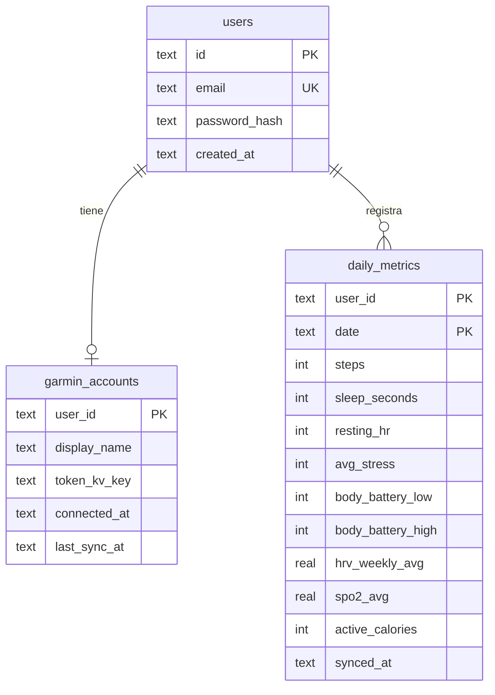
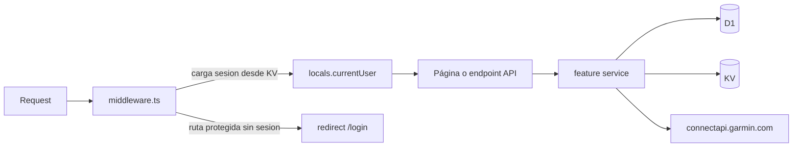

# Arquitectura

Garmin Cloud es una aplicación Astro SSR que corre íntegramente en un Cloudflare Worker. El frontend (islas React) y el backend (endpoints de API) viven en el mismo Worker; no hay servidor separado.

## Organización del código (feature-oriented)

Cada feature agrupa su capa HTTP (`api/`), su UI (`components/`) y su dominio (`lib/`). Lo transversal vive en `shared/`.

```
src/
├── features/
│   ├── auth/                 # registro, login, sesiones
│   │   ├── components/       # AuthForm
│   │   ├── lib/              # password (PBKDF2), session (KV), repos, guard
│   │   └── schemas.ts
│   ├── garmin-connect/       # vinculación con Garmin
│   │   ├── components/       # ConnectGarminForm
│   │   ├── lib/              # sso, connect-service, token-store, mfa-store,
│   │   │                     # connect-api-client, account repo
│   │   └── schemas.ts
│   ├── sync/                 # obtención de métricas
│   │   └── lib/              # garmin-metrics-source, sync-service
│   ├── metrics/              # lectura y visualización
│   │   ├── components/       # DashboardApp, MetricCards, TrendChart, MetricsTable
│   │   └── lib/              # metrics-repository, metrics-service, types
│   └── export/               # exportación
│       ├── components/       # ExportCsvCard
│       └── lib/              # csv
├── shared/
│   ├── lib/                  # crypto, encoding, errors, env, dates, validation, utils
│   └── ui/                   # componentes shadcn/ui
├── layouts/Layout.astro
├── pages/                    # rutas Astro (.astro) + endpoints (api/**)
├── middleware.ts             # auth guard + carga de sesión
└── env.d.ts                  # tipos de Env y App.Locals
```

Regla de dependencias: `features/*` puede usar `shared/*`; `sync` y `metrics` dependen de `garmin-connect` (dueño de la sesión Garmin). `shared` no depende de features.

## Bindings de Cloudflare

Declarados en [wrangler.jsonc](../wrangler.jsonc):

| Binding | Tipo | Uso |
|---------|------|-----|
| `DB` | D1 | `users`, `garmin_accounts`, `daily_metrics` |
| `APP_KV` | KV | `session:*`, `mfa:pending:*`, `garmin_tokens:*` |
| `ASSETS` | Assets | estáticos del build |

El `env` (bindings + secretos) se obtiene con `import { env } from 'cloudflare:workers'` a través de `shared/lib/env.ts`. El `ExecutionContext` (para `waitUntil`) se lee de `locals.cfContext`.

## Modelo de datos (D1)



Los **tokens OAuth no se guardan en D1**: `garmin_accounts.token_kv_key` solo referencia la entrada cifrada en KV.

## Flujo de una petición



## Endpoints de API

| Método | Ruta | Feature | Descripción |
|--------|------|---------|-------------|
| POST | `/api/auth/register` | auth | Crea cuenta y sesión |
| POST | `/api/auth/login` | auth | Inicia sesión |
| POST | `/api/auth/logout` | auth | Cierra sesión |
| POST | `/api/garmin/connect` | garmin-connect | Login Garmin (paso 1) |
| POST | `/api/garmin/mfa` | garmin-connect | Verifica código MFA (paso 2) |
| GET | `/api/garmin/status` | garmin-connect | Estado de vinculación |
| POST | `/api/garmin/disconnect` | garmin-connect | Desvincula y borra tokens |
| POST | `/api/sync?days=N` | sync | Sincroniza N días |
| GET | `/api/metrics?from&to` | metrics | Métricas por rango |
| GET | `/api/export/csv?from&to` | export | Descarga CSV |
