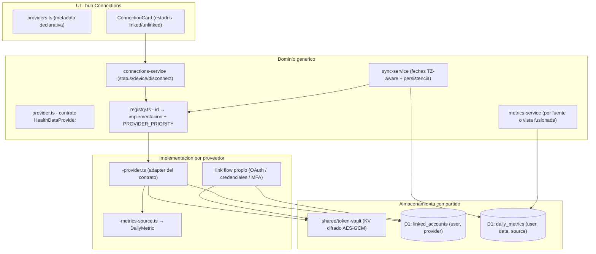

# Integraciones: cómo añadir un proveedor

**Track Forge** es un centro de datos y análisis: **métricas + integraciones + visualización (+ AI a futuro)**. Toda integración de datos de salud y rendimiento (Garmin hoy; Apple Health, Fitbit, Oura, nutrición… mañana) pasa por las mismas costuras para que puedas monitorear, comparar y analizar todo desde un solo lugar. Esta guía documenta el patrón y los pasos exactos.

## El patrón en una imagen



Piezas clave:

| Pieza | Archivo | Rol |
|-------|---------|-----|
| Contrato | `src/features/connections/lib/provider.ts` | Interfaz `HealthDataProvider` que todo proveedor implementa |
| Registry dominio | `src/features/connections/lib/registry.ts` | `id → implementación` + `PROVIDER_PRIORITY` (orden de merge) |
| Registry UI | `src/features/connections/providers.ts` | Metadata visual (nombre, icono, capabilities) |
| Servicio genérico | `src/features/connections/lib/connections-service.ts` | status / device / disconnect para cualquier proveedor |
| Cuentas vinculadas | `src/features/connections/lib/linked-account-repository.ts` | Tabla `linked_accounts` (una fila por usuario+proveedor) |
| Bóveda de tokens | `src/shared/lib/token-vault.ts` | Secretos cifrados AES-GCM en KV (`<provider>_tokens:<userId>`) |
| Sync | `src/features/sync/lib/sync-service.ts` | Provider-agnóstico; persiste con `source = provider` |
| Referencia | `src/features/garmin-connect/` | Implementación completa de ejemplo (Garmin) |

## Pasos para añadir un proveedor

Usa `features/garmin-connect/` como implementación de referencia.

### 1. Declara el proveedor (UI)

En [src/features/connections/providers.ts](../src/features/connections/providers.ts): extiende el union `ProviderId` y añade la entrada a `PROVIDERS` (nombre, tagline, `Icon` lucide, `accentClass` — clase Tailwind **estática** — y `capabilities`).

### 2. Implementa el link flow

Crea `src/features/<provider>-connect/lib/` con la autenticación propia del proveedor (OAuth 2, credenciales, lo que aplique):

- Persiste la sesión cifrada con `saveProviderTokens(env, '<provider>', userId, tokens)` — **nunca en D1**.
- Registra la cuenta con `LinkedAccountRepository.upsert({ userId, provider, displayName, tokenKvKey })`.
- Expón los endpoints del flujo bajo `src/pages/api/<provider>/` (p.ej. `connect.ts`, `callback.ts`).

### 3. Escribe la fuente de métricas

`<provider>-metrics-source.ts`: dado un cliente autenticado y una fecha ISO, devuelve un `DailyMetric` (todos los campos son nullable: si el proveedor no tiene un dato, va `null`; nunca rompas el día completo por una métrica).

### 4. Implementa el adapter del contrato

`<provider>-provider.ts` exportando un `HealthDataProvider`:

```ts
export const acmeProvider: HealthDataProvider = {
  id: 'acme',
  getConnection(env, userId) { /* linked_accounts */ },
  disconnect(env, userId) { /* borra tokens + fila */ },
  getDevice(env, userId) { /* opcional; tolerante a fallos */ },
  fetchDailyMetrics(env, userId, dates) { /* cliente + fuente de métricas */ },
};
```

### 5. Regístralo en el dominio

En [src/features/connections/lib/registry.ts](../src/features/connections/lib/registry.ts): añade la entrada a `HEALTH_PROVIDERS` y decide su posición en `PROVIDER_PRIORITY` (qué fuente gana campo a campo en la vista fusionada).

### 6. Crea la card del hub

`<Provider>ConnectionCard.tsx` con estados desconectado/conectado (copia el patrón de `GarminConnectionCard`) y regístrala en `AVAILABLE_CARDS` de `ConnectionsApp.tsx`. Los hooks de status/device/disconnect ya funcionan apuntando a `/api/connections/<provider>/...`.

### 7. Verifica

```bash
pnpm run check && pnpm exec astro check && pnpm run build
```

Y prueba manualmente: link → sync → dashboard → disconnect. No hace falta migración de DB: `linked_accounts` y `daily_metrics.source` ya soportan cualquier proveedor.

## Qué te regala la arquitectura (sin trabajo extra)

- **Estado y desconexión**: `/api/connections/<provider>/status|device-status|disconnect` funcionan en cuanto el adapter existe.
- **Sync**: `POST /api/sync` con `{ "provider": "<id>" }` sincroniza tu integración con fechas TZ-aware, límites y reporte incluidos.
- **Dashboard por integración**: `GET /api/metrics?source=<id>` devuelve solo esa fuente; sin `source`, la vista fusionada.
- **Export**: `GET /api/export/csv?source=<id>` exporta por fuente o fusionado.

## Diseñado para el futuro (capa de AI y más)

Decisiones de este diseño pensadas para lo que viene:

- **Lectura unificada por usuario**: `getMetrics(env, userId, range)` (sin `source`) es la vista consolidada de todas las integraciones. La futura capa de AI (tips, análisis de progreso, metas, recomendaciones) consumirá exactamente esta función — no necesita saber de proveedores.
- **BYOK para modelos premium**: la bóveda `token-vault` es genérica; las API keys que el usuario suba para usar modelos premium (Opus, GPT, Sonnet…) se guardarán cifradas en KV con el mismo patrón (p.ej. `ai_keys:<userId>`), nunca en D1. La selección de modelo será un setting más del usuario.
- **Nuevos tipos de datos** (p.ej. comidas/nutrición): siguen el mismo patrón — un proveedor más en el registry y, si sus datos no encajan en `daily_metrics`, una tabla propia con la misma dimensión `(user_id, date, source)`.
- **Prioridad de fuentes**: cuando haya varias integraciones activas, `PROVIDER_PRIORITY` resuelve conflictos campo a campo de forma determinista; si un día se quiere prioridad por métrica o por usuario, el único punto a tocar es `mergeRowsByDate` en `metrics-service.ts`.
