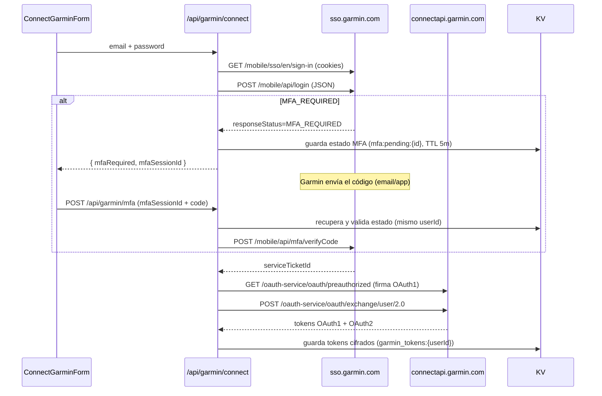

# Flujo de sincronización

Track Forge sincroniza métricas de forma **provider-agnóstica** vía `sync-service` (ver [architecture.md](architecture.md)). Esta guía detalla el flujo de la integración **Garmin Connect** — la primera disponible. Futuras integraciones seguirán el mismo patrón de adapter + link flow propio documentado en [integrations.md](integrations.md).

## 1. Login SSO de Garmin (con MFA)

Garmin ya no permite scraping HTML del login. Usamos su **API móvil JSON** (el mismo flujo que la app y que [garth](https://github.com/matin/garth)), implementada con `fetch` nativo en [`features/garmin-connect/lib/sso.ts`](../src/features/garmin-connect/lib/sso.ts).



Puntos clave:

- `clientId = GCM_ANDROID_DARK`, `service = mobile.integration.garmin.com/gcm/android`.
- Cabeceras de navegador (UA de iPhone) en SSO para evitar el challenge de Cloudflare; UA `com.garmin.android.apps.connectmobile` en OAuth.
- Firma OAuth1 HMAC-SHA1 con `oauth-1.0a` + `node:crypto` (`nodejs_compat`).
- El estado MFA vive en **KV con TTL de 5 min** y atado al `userId`, no en memoria: funciona aunque la segunda petición caiga en otro isolate.

## 2. Refresco de tokens

`ConnectApiClient` refresca el OAuth2 automáticamente cuando faltan <60 s para expirar, reintercambiando el OAuth1, y repersiste el token cifrado. Es transparente para las llamadas a la API.

## 3. Obtención de métricas

`syncUserMetrics(env, userId, days)` en [`features/sync/lib/sync-service.ts`](../src/features/sync/lib/sync-service.ts) recorre los últimos `days` días y, por cada fecha, pide en paralelo las 8 métricas wellness. Cada métrica está **aislada**: si un endpoint falla o no tiene datos, se guarda `null` en vez de romper el día.

| Métrica | Endpoint |
|---------|----------|
| Pasos | `/usersummary-service/stats/steps/daily/{date}/{date}` |
| Sueño | `/sleep-service/sleep/dailySleepData?date=` |
| FC reposo | `/wellness-service/wellness/dailyHeartRate?date=` |
| Estrés | `/wellness-service/wellness/dailyStress/{date}` |
| Body Battery | `/wellness-service/wellness/bodyBattery/reports/daily?startDate&endDate` |
| HRV | `/hrv-service/hrv/{date}` |
| SpO2 | `/wellness-service/wellness/daily/spo2/{date}` |
| Calorías activas | `/usersummary-service/usersummary/daily/{displayName}?calendarDate=` |

El resultado se hace `upsert` en `daily_metrics` (clave `user_id + date`), de modo que resincronizar un día lo actualiza sin duplicar.

## 4. Cuándo se sincroniza

- **On-demand**: al vincular Garmin (sincroniza 14 días en segundo plano vía `waitUntil`) y al pulsar «Sincronizar» en el dashboard (`POST /api/sync?days=N`).

### Escalado a background (Cron + Queue)

El servicio `syncUserMetrics` es la unidad reutilizable pensada para un consumidor de cola. Para automatizar el sync diario en producción:

1. Declarar una Queue y un Cron trigger en `wrangler.jsonc`.
2. Exponer handlers `scheduled` y `queue` en el Worker.

> Nota: el adaptador `@astrojs/cloudflare` solo genera el handler `fetch`. Añadir `scheduled`/`queue` requiere un entrypoint de Worker personalizado que reexporte el handler de Astro y añada los suyos. Por eso, en esta versión el sync automático se documenta como ruta de escalado y el sync on-demand es el camino soportado out-of-the-box. La lógica de negocio (`syncUserMetrics`) ya está lista para ambos.

Ejemplo de configuración objetivo:

```jsonc
{
  "triggers": { "crons": ["0 6 * * *"] },
  "queues": {
    "producers": [{ "binding": "SYNC_QUEUE", "queue": "garmin-sync" }],
    "consumers": [{ "queue": "garmin-sync", "max_batch_size": 1, "max_retries": 3 }]
  }
}
```

## Límites y buenas prácticas

- Garmin aplica rate limiting agresivo. Evita ráfagas de logins; si ves HTTP 429 / error 1015, espera 15-60 minutos.
- Cada intento de login con MFA genera un nuevo código; usa siempre el más reciente (caducan en ~30 min).
